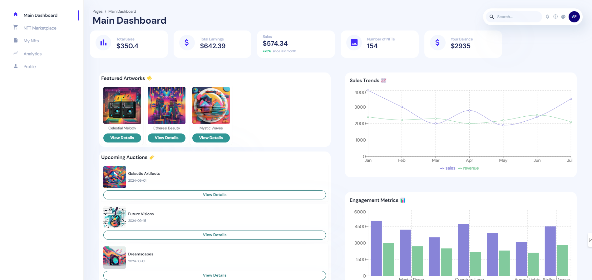
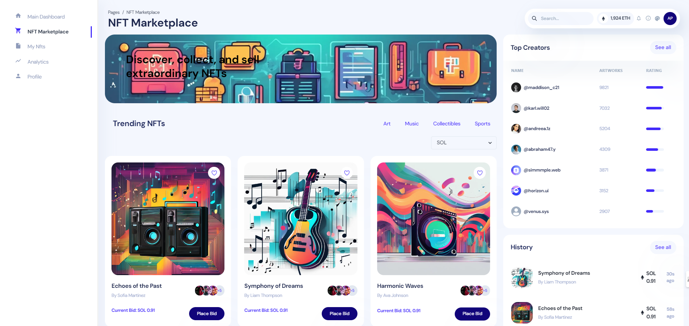

### Project Long Description

**Artify** is an innovative decentralized platform designed to transform the digital art marketplace by leveraging cutting-edge blockchain technologies. 🚀 It offers artists a unique opportunity to retain control over their work while providing buyers with a secure and transparent way to acquire digital art. 🔐 Artify addresses several critical issues faced by digital artists and buyers in the current market. 💡

**Key Features:**

1. **Decentralized Control and Distribution**: Artify utilizes blockchain technology to empower artists with full control over their creations. 🛠️ Artists can mint their artworks as Non-Fungible Tokens (NFTs) and sell them directly to buyers without intermediaries. 🌐 This eliminates the need for traditional galleries and platforms, allowing artists to keep the majority of their earnings and reach their audience directly. 🎨

2. **Secure Ownership and Provenance**: Every artwork sold on Artify is represented as an NFT, ensuring that ownership and authenticity are clearly established. 📜 These NFTs are stored on the Ethereum blockchain, which provides a secure, immutable record of the artwork’s provenance. 🛡️ This system significantly reduces the risk of piracy, unauthorized distribution, and disputes over ownership. 🔒

3. **Low Transaction Costs**: Artify leverages the Polygon network to facilitate transactions. 🪙 Polygon’s layer-2 solution offers significantly lower fees compared to traditional blockchain networks. 💸 This makes it more affordable for artists to mint and sell their work and for buyers to purchase art, particularly benefiting smaller transactions. 🏷️

4. **Global Access and Inclusivity**: Artify is accessible to anyone with an internet connection, breaking down geographical and financial barriers that often limit access to global art markets. 🌍 Artists from any location can showcase their work to a worldwide audience, and buyers can explore and purchase unique digital art from around the globe. 🌏

**Technologies Used:**

Artify integrates several advanced technologies to deliver its services:

- **Ethereum**: For creating and managing NFTs and smart contracts. 🧩
- **Polygon**: To handle efficient and low-cost transactions. 💵
- **Filecoin**: For decentralized storage of digital artworks. 📂
- **Solidity**: For developing smart contracts on Ethereum. 💻
- **IPFS**: For storing and retrieving files in a decentralized manner. 🌐
- **Web3.js**: For interacting with the Ethereum blockchain from web applications. 📲
- **React**: For building the user interface of the Artify platform. 🖥️
- **Node.js**: For server-side operations and API development. ⚙️
- **Hardhat**: For testing and deploying smart contracts. 🧪
- **OpenZeppelin**: For secure and audited smart contract libraries. 🔍

**Use Cases:**

- **Independent Artists**: Artists can create, mint, and sell their digital art directly on Artify, maintaining full control over their work and earnings. 🎨
- **Collectors and Buyers**: Buyers can purchase digital art with confidence, knowing they are acquiring authentic and verifiable pieces while supporting artists directly. 💖
- **Galleries and Curators**: Virtual galleries can be created to showcase curated collections of digital art, expanding their reach and engaging with a global audience. 🖼️

**Summary:**

Artify revolutionizes the digital art market by providing a decentralized, secure, and cost-effective platform for artists and buyers. 🌟 By integrating Ethereum, Polygon, Filecoin, and other technologies, Artify eliminates traditional barriers and offers a more inclusive and efficient marketplace for digital art. 🎨🔗
